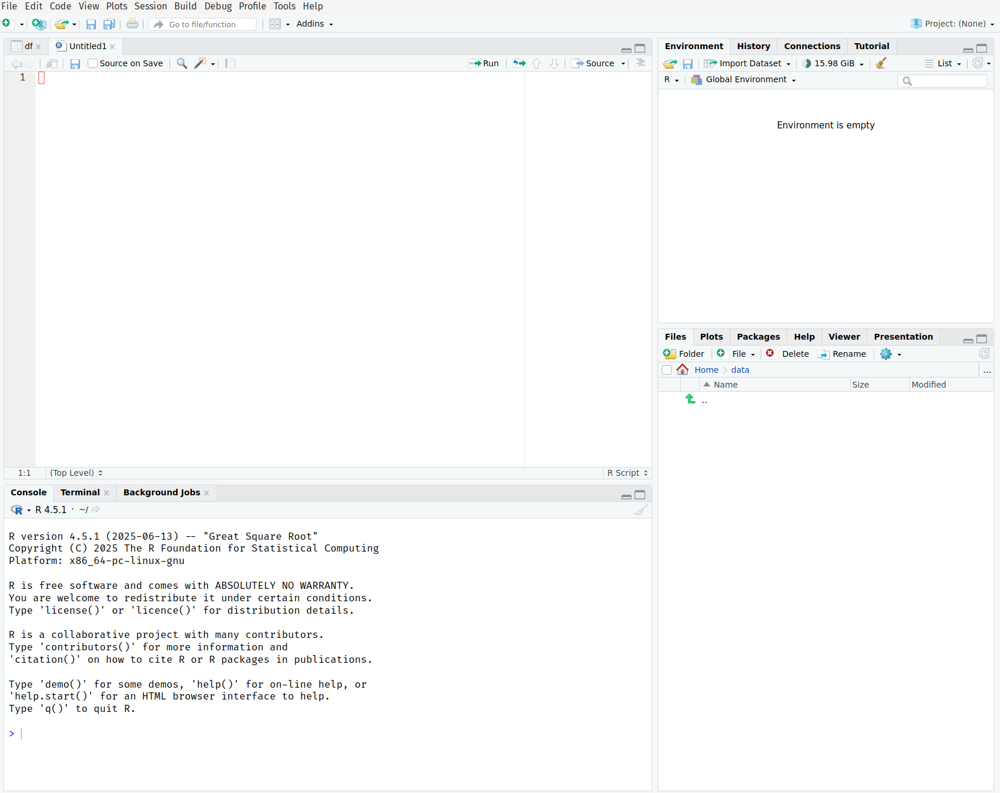

## Introduction

Now that you have R and RStudio installed and have experimented with R as a calculator, it's time to master the RStudio interface. RStudio is your command center for data analysis, and understanding its layout will make you much more efficient and productive.

Think of RStudio as the cockpit of your data science aircraft – every panel, button, and window has a purpose, and knowing where everything is will help you navigate your analytical journey smoothly.

## The Four-Pane Layout

When you open RStudio, you'll see four main panes.



Let's explore each one:

### 1. Source Pane (Top-Left)

The **Source pane** is your text editor where you write and edit R scripts, R Markdown documents, and other files.

**Key Features:**
- Syntax highlighting (different colors for different code elements)
- Auto-completion (press Tab while typing)
- Code folding (collapse/expand code sections)
- Multiple tabs for different files
- Line numbers for easy navigation

**Common File Types:**
- `.R` files: R scripts
- `.Rmd` files: R Markdown documents
- `.qmd` files: Quarto documents
- `.txt`, `.csv`: Data files

**Useful Shortcuts:**
- `Ctrl+Enter` (Windows/Linux) or `Cmd+Enter` (Mac): Run current line or selection
- `Ctrl+Shift+Enter`: Run entire script
- `Ctrl+S`: Save file
- `Ctrl+Z`: Undo

::: {.callout-tip}
If you don't see the Source pane, go to **File > New File > R Script** to create a new script.
:::

### 2. Console Pane (Bottom-Left)

The **Console** is where R commands are executed and results are displayed. This is the same console you used when learning R as a calculator.

**Key Features:**
- Interactive R prompt (`>`)
- Command history (use up/down arrows)
- Real-time output and error messages
- Auto-completion support

**Console Tabs:**
- **Console**: Main R interaction
- **Terminal**: System command line access
- **Background Jobs**: Long-running tasks

**Best Practices:**
- Use the console for quick tests and exploration
- Write important code in the Source pane (scripts)
- Don't rely on console for reproducible analysis

### 3. Environment/History Pane (Top-Right)

This pane contains several important tabs:

#### Environment Tab
Shows all objects (variables, functions, data) currently in your R workspace.

**Information Displayed:**
- Variable names and types
- Data preview for data frames
- Function definitions
- Memory usage

**Useful Features:**
- Click on data frames to view them
- Click the broom icon to clear environment
- Import data using the Import Dataset button

#### History Tab
Keeps track of all commands you've run in the current session.

**Features:**
- Search through command history
- Send commands back to console or source
- Save history for future reference

#### Connections Tab
Manage database connections (for advanced users).

#### Tutorial Tab
Access interactive tutorials (if installed).

### 4. Files/Plots/Packages/Help Pane (Bottom-Right)

This multi-purpose pane contains five essential tabs:

#### Files Tab
A file browser for navigating your computer's file system.

**Features:**
- Navigate folders and files
- Set working directory
- Create new folders
- Upload/download files
- View file details

#### Plots Tab
Displays all graphics and visualizations you create.

**Features:**
- View current and previous plots
- Export plots (PNG, PDF, etc.)
- Zoom in/out
- Navigate between multiple plots

#### Packages Tab
Manage R packages (extensions that add functionality).

**Features:**
- View installed packages
- Install new packages
- Load/unload packages
- Update packages
- Search CRAN

#### Help Tab
Access R documentation and help files.

**Features:**
- Search R documentation
- View function help pages
- Browse package documentation
- Access vignettes and tutorials

#### Viewer Tab
Display web content, HTML widgets, and local web applications.

## Customizing Your RStudio Interface

### Changing the Layout

You can customize the pane layout to suit your preferences:

1. Go to **Tools > Global Options**
2. Select **Pane Layout** from the left menu
3. Choose which tabs appear in which panes
4. Rearrange panes to your liking

### Themes and Appearance

Make RStudio comfortable for your eyes:

1. **Tools > Global Options > Appearance**
2. Choose from various themes:
   - **Light themes**: Default, Textmate, Tomorrow
   - **Dark themes**: Dracula, Material, Vibrant Ink
3. Adjust font size and type
4. Customize editor theme separately

### Useful Settings

Navigate to **Tools > Global Options** and consider these settings:

#### General
- **Restore .RData into workspace at startup**: Uncheck (recommended)
- **Save workspace to .RData on exit**: Never (recommended)
- **Always save history**: Check if desired

#### Code
- **Insert spaces for tab**: Check (recommended)
- **Tab width**: 2 or 4 spaces
- **Show line numbers**: Check
- **Highlight selected word**: Check

#### R Markdown
- **Show output inline**: Choose preference
- **Show output preview**: In Viewer Pane

## Essential RStudio Features

### Code Completion

RStudio provides intelligent code completion:

```{r}
#| eval: false
# Start typing and press Tab
mea  # Tab will show mean(), median(), etc.
dat  # Tab will show available data objects
```

### Code Snippets

Pre-written code templates that you can insert:

```{r}
#| eval: false
# Type these and press Tab:
fun   # Creates function template
if    # Creates if statement template
for   # Creates for loop template
lib   # Creates library() call
```

### Multiple Cursors

Hold `Ctrl` (Windows/Linux) or `Cmd` (Mac) and click to place multiple cursors for simultaneous editing.

### Code Folding

Click the small triangles next to line numbers to collapse/expand code sections.

### Find and Replace

- `Ctrl+F`: Find in current file
- `Ctrl+Shift+F`: Find in files (project-wide search)
- `Ctrl+H`: Find and replace

## Working with Scripts

### Creating a New Script

1. **File > New File > R Script**
2. Or use shortcut: `Ctrl+Shift+N`

### Best Practices for Scripts

```{r}
#| eval: false
# ============================================================================
# Project: My First R Analysis
# Author: Your Name
# Date: 2024-09-21
# Description: Learning RStudio interface
# ============================================================================

# Load required libraries
library(tidyverse)

# Set up working directory
setwd("~/Documents/R-Projects")

# Your analysis code here...

# Section 1: Data Import ----
# (Four dashes create a foldable section)

# Section 2: Data Cleaning ----

# Section 3: Analysis ----

# Session info for reproducibility
sessionInfo()
```

### Running Code from Scripts

- **Current line**: `Ctrl+Enter`
- **Selected lines**: Highlight and `Ctrl+Enter`
- **Entire script**: `Ctrl+Shift+Enter`
- **Current chunk**: `Ctrl+Shift+C` (in R Markdown)

## RStudio Projects

### What are Projects?

RStudio Projects help organize your work by:
- Setting working directory automatically
- Preserving command history
- Managing workspace
- Integrating with version control (Git)

### Creating a Project

1. **File > New Project**
2. Choose:
   - **New Directory**: Start fresh
   - **Existing Directory**: Use existing folder
   - **Version Control**: Clone from Git repository

3. Give your project a name and location
4. Click **Create Project**

### Project Benefits

```{r}
#| eval: false
# With projects, you can use relative paths
read.csv("data/my_data.csv")  # Instead of full path

# Projects remember your settings
# - Open files
# - Working directory
- Command history
```

## Keyboard Shortcuts (Essential)

### General
- `Ctrl+N`: New file
- `Ctrl+O`: Open file
- `Ctrl+S`: Save
- `Ctrl+Shift+S`: Save as
- `Ctrl+W`: Close current tab

### Code Execution
- `Ctrl+Enter`: Run current line/selection
- `Ctrl+Shift+Enter`: Run entire script
- `Ctrl+Shift+P`: Re-run previous region

### Navigation
- `Ctrl+1`: Focus Source pane
- `Ctrl+2`: Focus Console pane
- `Ctrl+.`: Go to file/function
- `F1`: Help on selected function

### Editing
- `Ctrl+A`: Select all
- `Ctrl+D`: Delete line
- `Ctrl+Shift+D`: Duplicate line
- `Alt+Up/Down`: Move lines up/down

## Getting Help

### Built-in Help System

```{r}
#| eval: false
# Different ways to get help
help(mean)        # Formal help page
?mean             # Shortcut for help
??mean            # Search for functions containing "mean"
example(mean)     # Run examples from help page
```

### Help Panel Features

- **Search box**: Find functions and topics
- **Contents**: Browse package documentation
- **Index**: Alphabetical function list

## Troubleshooting Common Issues

### Panes Disappeared

- **View > Panes > Show All Panes**
- Or drag pane dividers to make them visible

### Console Shows `+` Instead of `>`

- You have an incomplete command
- Press `Esc` to cancel and return to normal prompt

### Script Won't Run

- Check for syntax errors (red X marks in margin)
- Ensure proper parentheses and quotes matching
- Look for error messages in console

### RStudio is Slow

- Clear workspace: `rm(list = ls())`
- Restart R: **Session > Restart R**
- Close unnecessary tabs and plots

## Practical Exercise

Let's practice using the RStudio interface:

1. **Create a new R script**
2. **Add this header:**

```{r}
#| eval: false
# ============================================================================
# Practice Script: RStudio Interface
# Date: Today's date
# ============================================================================

# Practice calculations
simple_calculation <- 10 + 5 * 2
print(simple_calculation)

# Create some data
my_numbers <- c(1, 2, 3, 4, 5)
my_mean <- mean(my_numbers)
my_sum <- sum(my_numbers)

# Display results
cat("Numbers:", my_numbers, "\n")
cat("Mean:", my_mean, "\n")
cat("Sum:", my_sum, "\n")
```

3. **Save the script** as "rstudio_practice.R"
4. **Run the code** line by line using `Ctrl+Enter`
5. **Observe** how variables appear in the Environment pane
6. **Get help** on the `mean` function using `?mean`

## Summary

You now understand the RStudio interface:

- **Source pane**: Write and edit scripts
- **Console pane**: Execute commands interactively
- **Environment pane**: View workspace objects and history
- **Files/Plots/Help pane**: Manage files, view plots, get help

### Key Takeaways

1. **Use scripts** for reproducible analysis
2. **Organize work** with RStudio Projects
3. **Leverage shortcuts** for efficiency
4. **Customize interface** to your preferences
5. **Use built-in help** extensively

## Next Steps

Now that you're comfortable with the RStudio interface:

- [R Scripts and Projects](r-scripts-projects.qmd) - Organize your R work effectively

::: {.callout-tip}
## Pro Tip

Spend time customizing RStudio to your preferences early on. A comfortable workspace leads to more productive analysis sessions!
:::

The more you use RStudio, the more natural it becomes. Don't worry about memorizing everything – muscle memory develops with practice!
